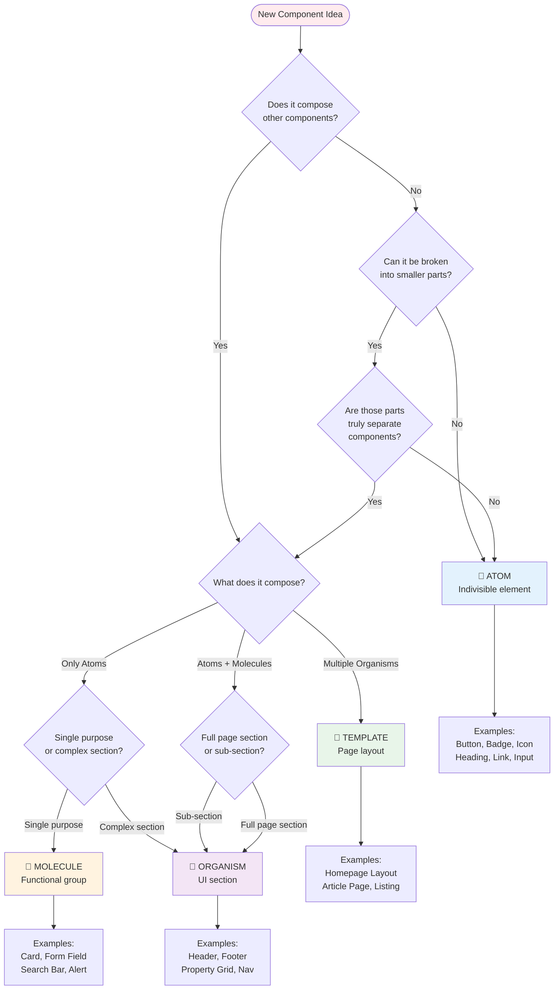
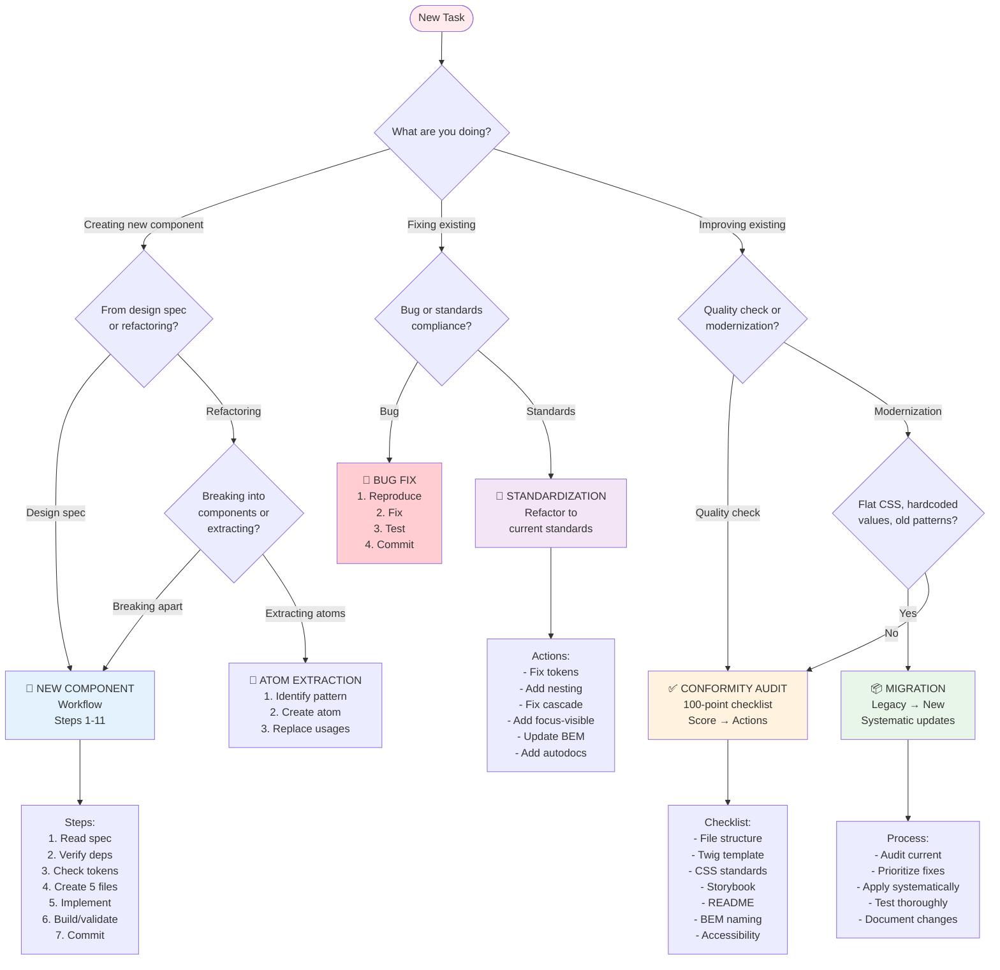

# Decision Flowcharts - PS Theme

**Scope**: Visual decision trees for architectural choices, component planning, workflow selection

---

## 📖 When to Use This Guide

**Use these flowcharts when you need to decide:**
- ✅ Which **atomic level** to use (Atom vs Molecule vs Organism)
- ✅ Which **composition method** to choose (include vs embed vs extend)
- ✅ Whether to **create a new token** or use existing
- ✅ Which **workflow** to follow (new component vs refactor vs audit)
- ✅ How to **override styles** in composed components (Token-First cascade)

**Each flowchart provides:**
- Clear decision criteria (yes/no questions)
- Visual path to the right choice
- Links to detailed documentation
- Real-world examples

---

## 🎯 Table of Contents

1. [Component Level Selection](#1-component-level-selection) - Atom vs Molecule vs Organism vs Template
2. [Composition Method Selection](#2-composition-method-selection) - Include vs Embed vs Extend
3. [Token Usage Decision](#3-token-usage-decision) - Use vs Create vs Component-scoped
4. [Workflow Selection](#4-workflow-selection) - New vs Refactor vs Audit vs Migration
5. [CSS Override Strategy](#5-css-override-strategy) - Token-First 4-step cascade

---

## 1. Component Level Selection

**Question**: "What atomic level should my component be?"



### Decision Criteria

**ATOM** (Elements):
- ✅ Indivisible (can't break into smaller components)
- ✅ Maps to basic HTML element or irreducible pattern
- ✅ Standalone (but may be useless without context)
- ✅ NO composition (doesn't include other components)
- ❌ NOT Token-First workflow (atoms are autonomous)
- **Examples**: Button, Badge, Icon, Heading, Link, Input, Avatar, Divider

**MOLECULE** (Components):
- ✅ Composes 2+ atoms
- ✅ Single responsibility (does ONE thing well)
- ✅ Portable (drop anywhere needed)
- ✅ Adds context/meaning to atoms
- ✅ **Token-First workflow APPLIES**
- **Examples**: Card, Form Field, Search Form, Alert, Breadcrumb, Dropdown

**ORGANISM** (Collections):
- ✅ Composes molecules and/or atoms
- ✅ Complex layout and logic
- ✅ Represents distinct UI section
- ✅ Multiple responsibilities (full feature)
- ✅ **Token-First workflow APPLIES**
- **Examples**: Header, Footer, Property Grid, Navigation, Article List, Hero Section

**TEMPLATE** (Layouts):
- ✅ Orchestrates full page layout
- ✅ Composes organisms + molecules
- ✅ Defines page structure (slots, regions)
- ✅ **Token-First workflow APPLIES**
- **Examples**: Homepage Layout, Article Page, Listing Page, Dashboard Layout

**See**: `.github/instructions/atomic-design.instructions.md`

---

## 2. Composition Method Selection

**Question**: "How should I compose/reuse another component?"

```mermaid
flowchart TD
    Start([Need to use<br/>another component]) --> Q1{Need to customize<br/>inner structure?}
    
    Q1 -->|No| Q2{Just displaying<br/>with props?}
    Q1 -->|Yes| Q3{Replace entire<br/>sections or<br/>add content?}
    
    Q2 -->|Yes| Include[✅ USE INCLUDE<br/> with only]
    Q2 -->|No| Q4{Extending base<br/>functionality?}
    
    Q3 -->|Replace sections| Embed[✅ USE EMBED<br/> with blocks]
    Q3 -->|Add to existing| Q5{Adding slots<br/>or overriding?}
    
    Q4 -->|Yes| Extend[✅ USE EXTEND<br/><br/>rarely used in PS]
    Q4 -->|No| Include
    
    Q5 -->|Adding slots| Embed
    Q5 -->|Overriding| Q6{Change behavior<br/>or just styles?}
    
    Q6 -->|Just styles| TokenFirst[✅ USE TOKEN-FIRST<br/>Override tokens<br/>in CSS]
    Q6 -->|Change behavior| Custom[⚠️ CREATE CUSTOM<br/>New component<br/>specific variant]
    
    Include --> IncludeEx[Example:<br/>Card includes Button<br/>Alert includes Icon]
    Embed --> EmbedEx[Example:<br/>Card variant with<br/>custom header block]
    TokenFirst --> TokenEx[Example:<br/>Card Offer Search<br/>overrides Card tokens]
    
    style Include fill:#c8e6c9
    style Embed fill:#fff9c4
    style Extend fill:#ffccbc
    style TokenFirst fill:#b3e5fc
    style Custom fill:#f8bbd0
    style Start fill:#ffebee
```

### Method Details

**** - Simple Prop Passing (MOST COMMON):
```twig
{# Use when: Just passing props, no structure changes #}

```
- ✅ Most common (90% of cases)
- ✅ Clean prop contract
- ✅ Isolated scope (`only` keyword)
- ❌ Can't customize inner structure

**** - Block Replacement (ADVANCED):
```twig
{# Use when: Need to replace/add sections #}

  
    <div class="custom-header">...</div>
  

```
- ✅ Replace specific blocks
- ✅ Keep base structure
- ⚠️ Use sparingly (complexity risk)
- **See**: `card-inheritance.instructions.md` for Card-specific patterns

**** - Base Template Extension (RARE):
```twig
{# Use when: Creating page templates #}


  <!-- Page content -->

```
- ✅ Page-level templates
- ❌ Rarely used for components
- ⚠️ Creates tight coupling

**Token-First Override** (PREFERRED for Style Customization):
```css
/* Use when: Customizing composed component styles */
.ps-card-offer-search {
  /* Override parent Card tokens */
  --ps-card-padding-x: var(--size-6);
  --ps-card-gap: var(--size-4);
  
  /* Override child atoms tokens */
  --ps-button-size: var(--size-6);
}
```
- ✅ No structural changes
- ✅ Maintains parent component integrity
- ✅ Clean separation of concerns
- **See**: `composition-token-first.instructions.md`

---

## 3. Token Usage Decision

**Question**: "Should I use an existing token, create a new one, or use component-scoped?"

```mermaid
flowchart TD
    Start([Need a value<br/>color, size, etc.]) --> Q1{Search existing<br/>tokens<br/>grep -r '--token'}
    
    Q1 -->|Found exact match| UseExisting[✅ USE EXISTING<br/>var\(--token\)]
    Q1 -->|Found similar| Q2{Close enough<br/>or need exact?}
    Q1 -->|Not found| Q3{Used in 3+<br/>components?}
    
    Q2 -->|Close enough| UseExisting
    Q2 -->|Need exact| Q3
    
    Q3 -->|Yes| Q4{Fits design<br/>system pattern?}
    Q3 -->|No| ComponentScoped[✅ COMPONENT-SCOPED<br/>--ps-component-*]
    
    Q4 -->|Yes| Q5{Semantic meaning<br/>or primitive value?}
    Q4 -->|No| ComponentScoped
    
    Q5 -->|Semantic| CreateSemantic[✅ CREATE SEMANTIC<br/>Propose via<br/>TOKEN_CREATION_PROCESS]
    Q5 -->|Primitive| CreatePrimitive[✅ CREATE PRIMITIVE<br/>Propose via<br/>TOKEN_CREATION_PROCESS]
    
    UseExisting --> ExUse[Example:<br/>var\(--primary\)<br/>var\(--size-4\)]
    ComponentScoped --> ExScoped[Example:<br/>--ps-card-padding<br/>--ps-button-hover-bg]
    CreateSemantic --> ExSemantic[Example:<br/>--success new variant<br/>--radius-xl new size]
    CreatePrimitive --> ExPrimitive[Example:<br/>--green-750 new shade<br/>--size-11 new scale]
    
    ComponentScoped --> Layer2[Layer 2:<br/>Component variables<br/>Default values]
    CreateSemantic -.->|After approval| Layer1Semantic[Layer 1:<br/>Semantic tokens<br/>brand.css]
    CreatePrimitive -.->|After approval| Layer1Primitive[Layer 1:<br/>Primitive tokens<br/>colors.css, sizes.css]
    
    style UseExisting fill:#c8e6c9
    style ComponentScoped fill:#fff9c4
    style CreateSemantic fill:#ffccbc
    style CreatePrimitive fill:#f8bbd0
    style Start fill:#ffebee
```

### Token Decision Criteria

**USE EXISTING TOKEN** (First Choice):
```bash
# Step 1: Search for token
grep -r "--primary" source/props/

# Step 2: Verify it matches need
# If yes → Use it immediately
```
- ✅ Maintains consistency
- ✅ No approval needed
- ✅ Already tested
- **When**: Exact or close-enough match exists

**COMPONENT-SCOPED TOKEN** (Layer 2):
```css
.ps-card {
  /* Component-level defaults */
  --ps-card-padding: var(--size-6);
  --ps-card-gap: var(--size-4);
  
  /* Use component variable */
  padding: var(--ps-card-padding);
  gap: var(--ps-card-gap);
}
```
- ✅ Component-specific value
- ✅ Enables context overrides
- ✅ No global pollution
- **When**: Used only in this component OR needs component-level default

**CREATE NEW GLOBAL TOKEN** (Layer 1):
```css
/* AFTER approval via TOKEN_CREATION_PROCESS */
/* source/props/brand.css */
--warning: hsl(45, 100%, 51%);  /* New semantic token */

/* source/props/sizes.css */
--size-11: 2.75rem;  /* New primitive token */
```
- ⚠️ Requires design team approval
- ⚠️ Must fit existing scale/pattern
- ⚠️ Must be used in 3+ components
- **When**: Design decision affecting multiple components
- **Process**: Follow `TOKEN_CREATION_PROCESS.md`

### Token Search Commands

```bash
# Search by category
grep -r "--primary" source/props/brand.css      # Semantic colors
grep -r "--size-" source/props/sizes.css        # Spacing/sizing
grep -r "--font-" source/props/fonts.css        # Typography
grep -r "--radius-" source/props/borders.css    # Border radius
grep -r "--shadow-" source/props/shadows.css    # Box shadows
grep -r "--duration-" source/props/animations.css  # Animation timing

# Search by value pattern
grep -r "hsl(162" source/props/                 # Find green shades
grep -r "0.25rem\|0.5rem\|0.75rem" source/props/  # Find size increments
```

**See**: `TOKEN_CREATION_PROCESS.md` for complete token creation workflow

---

## 4. Workflow Selection

**Question**: "Which workflow should I follow for this task?"



### Workflow Details

**NEW COMPONENT** (11-Step Process):
1. Read specification (`docs/design/{level}/{component}.md`)
2. Verify dependencies (atoms exist for molecules)
3. Token verification (`npm run tokens:check`)
4. Create 5 required files (twig, css, yml, stories, README)
5. Implement Twig template (header, defaults, BEM classes)
6. Implement CSS (tokens, nesting, cascade, focus-visible)
7. Create YAML data (Real Estate context)
8. Create Storybook stories (autodocs, showcases)
9. Create README (usage, props, BEM, tokens, a11y)
10. Build and validate (`npm run build`, visual check)
11. Commit and update changelog

**Estimated time**: 2-4 hours

**See**: `.github/instructions/workflows.instructions.md` (Component Generation Workflow)

---

**CONFORMITY AUDIT** (100-Point Checklist):
- File Structure (10 pts) - 5 files exist, named correctly
- Twig Template (15 pts) - Header, defaults, no arrow functions
- CSS (20 pts) - Tokens only, nesting, cascade, focus-visible
- Storybook (20 pts) - Autodocs, argTypes, showcases
- YAML (10 pts) - Real Estate data, all props
- README (10 pts) - All sections (usage, props, BEM, tokens, a11y)
- BEM Naming (10 pts) - ps- prefix, no double __
- Accessibility (5 pts) - WCAG AA, focus, contrast, ARIA

**Pass score**: 90-100 (Production ready)

**See**: `.github/instructions/workflows.instructions.md` (Conformity Audit Workflow)

---

**STANDARDIZATION** (Legacy → New Standards):
1. Run conformity audit (identify violations)
2. Prioritize fixes (critical → important → nice-to-have)
3. Apply fixes systematically:
   - Hardcoded values → tokens
   - Flat CSS → nesting
   - Wrong cascade → correct order
   - Missing focus-visible → add
   - Wrong BEM → fix prefix/structure
   - Missing autodocs → add
4. Test and validate (`npm run build`, visual check)
5. Document changes (commit message + changelog)

**Estimated time**: 1-3 hours depending on violations

**See**: `.github/instructions/workflows.instructions.md` (Standardization Workflow)

---

**MIGRATION** (Systematic Pattern Updates):
- Use when: Multiple components need same update
- Examples:
  - Flat CSS → Nesting (all components)
  - Old token → New token (global replacement)
  - Deprecated pattern → New pattern
- Process:
  1. Audit all affected components
  2. Create migration script if possible
  3. Update systematically (one pattern at a time)
  4. Test each component after update
  5. Document breaking changes

**Estimated time**: 4-8 hours for project-wide changes

---

**BUG FIX** (Quick Targeted Fix):
1. Reproduce bug reliably
2. Identify root cause
3. Implement fix (minimal scope)
4. Test fix thoroughly
5. Commit with clear description

**Estimated time**: 30 minutes - 2 hours

---

**ATOM EXTRACTION** (DRY Principle):
1. Identify repeated pattern across components
2. Create atom with minimal API
3. Replace all usages with includes
4. Test all consuming components
5. Document atom usage

**Estimated time**: 2-3 hours

---

## 5. CSS Override Strategy (Token-First)

**Question**: "How should I customize a composed component's styles?"

```mermaid
flowchart TD
    Start([Need to customize<br/>composed component]) --> Step1{STEP 1:<br/>Native params<br/>exist?}
    
    Step1 -->|Yes| UseParams[✅ USE PARAMS<br/>Pass via props]
    Step1 -->|No| Step2{STEP 2:<br/>Utility class<br/>can solve?}
    
    UseParams --> Done1[DONE<br/>Example: size='lg']
    
    Step2 -->|Yes| UseUtils[✅ USE UTILITY<br/>attributes.addClass]
    Step2 -->|No| Step3{STEP 3:<br/>Component exposes<br/>tokens?}
    
    UseUtils --> Done2[DONE<br/>Example: u-padding-4]
    
    Step3 -->|Yes| OverrideTokens[✅ OVERRIDE TOKENS<br/>in consumer CSS<br/>PREFERRED]
    Step3 -->|No| Step4[STEP 4:<br/>Targeted CSS<br/>LAST RESORT]
    
    OverrideTokens --> TokenEx[Example:<br/>--ps-card-padding: var\(--size-6\)]
    Step4 --> TargetEx[Example:<br/>& .ps-card__content &#123;...&#125;]
    
    TokenEx --> Done3[DONE<br/>Clean override]
    TargetEx --> Done4[DONE<br/>Use sparingly]
    
    style UseParams fill:#c8e6c9
    style UseUtils fill:#fff9c4
    style OverrideTokens fill:#b3e5fc
    style Step4 fill:#ffccbc
    style Start fill:#ffebee
```

### Token-First Cascade (4 Steps)

**STEP 1: Check Native Parameters** (First choice):
```twig
{# Component already provides layout, size, radius params? #}

```
✅ **IF YES** → Use native params, **STOP**  
❌ **IF NO** → Go to Step 2

---

**STEP 2: Check Utility Classes** (Second choice):
```twig

```
✅ **IF YES** → Use utility classes, **STOP**  
❌ **IF NO** → Go to Step 3

---

**STEP 3: Override Parent/Child Tokens** ⭐ **PREFERRED**:
```css
/* card-offer-search.css (CONSUMER) */
.ps-card-offer-search {
  /* Override PARENT (Card) tokens */
  --ps-card-padding-x: var(--size-6);
  --ps-card-padding-y: var(--size-7);
  --ps-card-gap: var(--size-6);
  
  /* Override CHILD (Atoms) tokens */
  --ps-button-size: var(--size-6);
  --ps-badge-font-size: var(--font-size-0);
  --ps-link-text-decoration: none;
}
```
✅ **IF POSSIBLE** → Override tokens, **STOP**  
❌ **IF IMPOSSIBLE** → Go to Step 4

---

**STEP 4: Targeted CSS Override** (Last resort):
```css
/* card-offer-search.css */
.ps-card-offer-search {
  /* ⚠️ Target parent elements (last resort) */
  & .ps-card__content {
    padding: var(--size-7) var(--size-6);
    display: flex;
  }
  
  & .ps-card__media {
    flex: 0 0 33.6%;  /* Unique to this design */
  }
}
```
⚠️ **CAUTION**:
- Use `&` to maintain scope
- Never modify source component CSS
- Only for truly unique cases
- Document why targeted override needed

---

### Token-First Benefits

**Why prefer token overrides?**
- ✅ Non-invasive (doesn't modify parent component)
- ✅ Maintainable (clear customization points)
- ✅ Scalable (multiple consumers can override differently)
- ✅ Type-safe (tokens have defined values)
- ✅ Respects component integrity

**When is targeted CSS acceptable?**
- Unique proportions (33.6% / 66.4% layout)
- Complex nested selectors
- Structural changes not exposed via tokens
- Design spec requires specific override

**See**: `.github/instructions/composition-token-first.instructions.md` (Complete 4-step workflow)

---

## 📊 Quick Reference Matrix

| Need | Flowchart | Key Decision | Documentation |
|------|-----------|--------------|---------------|
| **What level?** | #1 Component Level | Composes components? | atomic-design.instructions.md |
| **How to compose?** | #2 Composition Method | Customize structure? | composition-token-first.instructions.md |
| **Token usage?** | #3 Token Decision | Used 3+ times? | TOKEN_CREATION_PROCESS.md |
| **Which workflow?** | #4 Workflow Selection | Creating or fixing? | workflows.instructions.md |
| **Style override?** | #5 CSS Override | Params → Utils → Tokens → CSS | composition-token-first.instructions.md |

---

## 🎯 Real-World Decision Examples

### Example 1: Creating Property Listing Component

**Question**: "Should Property Listing be Atom, Molecule, or Organism?"

**Analysis**:
1. Does it compose other components? **YES** (includes Image, Badge, Heading, Text, Button)
2. What does it compose? **Atoms only**
3. Single purpose or complex? **Single purpose** (displays one property)

**Decision**: **MOLECULE** (Card pattern)

**Flowchart Used**: #1 Component Level Selection

---

### Example 2: Customizing Card for Offer Search

**Question**: "How do I make Card have specific padding for Offer Search page?"

**Analysis**:
1. STEP 1: Native params? Card has `size` but not specific padding → **NO**
2. STEP 2: Utility class? `u-padding-7` exists → But violates design spec (mix of x/y) → **NO**
3. STEP 3: Card exposes tokens? **YES** (`--ps-card-padding-x`, `--ps-card-padding-y`)

**Decision**: **Override tokens in card-offer-search.css**

```css
.ps-card-offer-search {
  --ps-card-padding-x: var(--size-6);  /* 24px */
  --ps-card-padding-y: var(--size-7);  /* 30px */
}
```

**Flowchart Used**: #5 CSS Override Strategy

---

### Example 3: Need Yellow Warning Color

**Question**: "Should I create --warning token or use --yellow-500?"

**Analysis**:
1. Search existing: `grep -r "--warning" source/props/` → **NOT FOUND**
2. Used 3+ times? **YES** (Alert, Badge, Button all need warning state)
3. Fits design system? **YES** (semantic color token)
4. Semantic meaning? **YES** (represents "caution/warning" state)

**Decision**: **Create semantic token** via TOKEN_CREATION_PROCESS

**Flowchart Used**: #3 Token Usage Decision

---

### Example 4: Legacy Component with Flat CSS

**Question**: "Should I audit or migrate this old component?"

**Analysis**:
1. What are you doing? **Improving existing**
2. Quality check or modernization? **Modernization** (flat CSS, hardcoded values)
3. Flat CSS, old patterns? **YES**

**Decision**: **MIGRATION workflow** (systematic pattern update)

**Actions**:
- Flat CSS → Nesting with `&`
- Hardcoded colors → Token variables
- No focus-visible → Add with WCAG contrast
- No autodocs → Add `tags: ['autodocs']`

**Flowchart Used**: #4 Workflow Selection

---

## 🔗 Related Documentation

- **Atomic Design Methodology**: `.github/instructions/atomic-design.instructions.md`
- **Token-First Composition**: `.github/instructions/composition-token-first.instructions.md`
- **Component Workflows**: `.github/instructions/workflows.instructions.md`
- **Token Creation Process**: `.github/instructions/TOKEN_CREATION_PROCESS.md`
- **CSS Standards**: `.github/instructions/css.instructions.md`
- **Troubleshooting**: `.github/instructions/TROUBLESHOOTING_GUIDE.md`

---

## 💡 Tips for Using Flowcharts

1. **Start with the question** - Each flowchart answers a specific architectural question
2. **Follow yes/no paths** - Answer honestly based on actual requirements
3. **Read examples** - Real-world scenarios help validate your decision
4. **Link to docs** - Flowcharts provide direction, full docs provide implementation
5. **Iterate if needed** - If answer feels wrong, reconsider earlier decisions

---

**Last Updated**: 2025-12-12  
**Maintainers**: Design System Team
