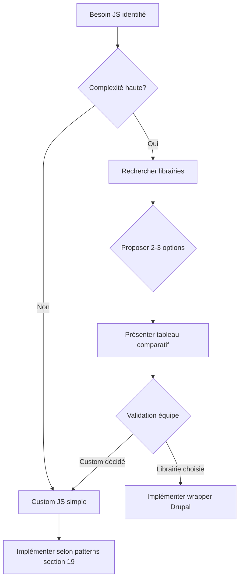

# 📋 PS Theme - Règles Complètes et Standards (REFERENCE ABSOLUE)

**Version**: 2.0.0  
**Date**: 2025-11-30  
**Statut**: 🔒 **DOCUMENT DE RÉFÉRENCE OBLIGATOIRE - À APPLIQUER SYSTÉMATIQUEMENT**

---

## 🎯 Objectif

Ce document centralise **TOUTES** les règles, normes et standards du projet PS Theme. **Aucune exception n'est tolérée** - ces règles doivent être appliquées **à chaque composant, à chaque modification, à chaque commit**.

---

## 📚 Table des Matières

1. [Stack Technique](#1-stack-technique)
2. [Architecture des Fichiers](#2-architecture-des-fichiers)
3. [BEM & Nomenclature](#3-bem--nomenclature)
4. [Design Tokens](#4-design-tokens)
5. [CSS Moderne (Nesting)](#5-css-moderne-nesting)
6. [Cascade & Spécificité](#6-cascade--spécificité)
7. [Minimal Markup](#7-minimal-markup)
8. [Modifiers CSS Indépendants](#8-modifiers-css-indépendants)
9. [Icons System](#9-icons-system)
10. [Semantic Color Naming](#10-semantic-color-naming)
11. [Storybook Standards](#11-storybook-standards)
12. [Twig Templates](#12-twig-templates)
13. [YAML Configuration](#13-yaml-configuration)
14. [Documentation](#14-documentation)
15. [Accessibilité](#15-accessibilité)
16. [Performance](#16-performance)
17. [Workflow & Validation](#17-workflow--validation)
18. [Checklist Composant Complet](#18-checklist-composant-complet)
19. [JavaScript & Drupal Behaviors](#19-javascript--drupal-behaviors)
20. [JavaScript Integration in Storybook](#20-javascript-integration-in-storybook)

---

## 1. Stack Technique

### Build System

```yaml
Bundler: Vite 5.x
CSS Processor: PostCSS
  - postcss-import
  - postcss-import-ext-glob
  - postcss-nested (✅ CSS Nesting supporté)
  - postcss-global-data
  - postcss-preset-env (stage 4)
  - autoprefixer
Linters:
  - Stylelint (config-standard + stylelint-order)
  - Biome (JS/JSX uniquement, CSS désactivé)
Browserslist: "last 2 versions and not dead", ">= 1%"
```

### Design System Tools

```yaml
Storybook: HTML/Vite edition (❌ PAS React)
Template Engine: Twig
Pattern Library: Atomic Design (Elements/Components/Collections/Layouts/Pages)
```

---

## 2. Architecture des Fichiers

### Structure Obligatoire par Composant

Chaque composant **DOIT** contenir exactement **5 fichiers** :

```
source/patterns/{level}/{component}/
├── {component}.twig          # Template Twig
├── {component}.css           # Styles CSS
├── {component}.yml           # Données par défaut
├── {component}.stories.jsx   # Stories Storybook
└── README.md                 # Documentation
```

**❌ INTERDIT** :
- Fichiers manquants
- Nommage incohérent (tous les fichiers doivent avoir le même nom de base)
- Fichiers supplémentaires non documentés

### Organisation des Design Tokens

```
source/props/
├── index.css          # Import global
├── colors.css         # Couleurs (--gray-*, --green-*, --blue-*, etc.)
├── brand.css          # Marque (--brand-primary, --brand-secondary)
├── fonts.css          # Typographie (--font-size-*, --font-weight-*)
├── sizes.css          # Espacements (--size-*)
├── borders.css        # Bordures (--radius-*, --border-size-*)
├── shadows.css        # Ombres (--shadow-*)
├── animations.css     # Animations (--duration-*, --delay-*)
├── easing.css         # Transitions (--ease-*)
├── zindex.css         # Z-index (--z-*)
├── icons.css          # Font icons (--icon-* mappings)
└── ...
```

**⚠️ CRITIQUE** : **JAMAIS** créer de fichier `ps-tokens.css` ou similaire - les tokens sont **organisés par catégorie**.

---

## 3. BEM & Nomenclature

### Règles BEM Strictes

```css
/* ✅ CORRECT */
.ps-component { }                    /* Block */
.ps-component__element { }           /* Element */
.ps-component--modifier { }          /* Modifier */
.ps-component__element--modifier { } /* Element modifier */

/* ❌ INTERDIT */
.component { }                       /* Manque préfixe ps- */
.ps-component-element { }            /* Séparateur incorrect (- au lieu de __) */
.ps-component_modifier { }           /* Séparateur incorrect (_ au lieu de --) */
.ps-component__element__nested { }   /* Double imbrication interdite */
```

### Préfixe Obligatoire

**TOUS** les nouveaux composants **DOIVENT** utiliser le préfixe `ps-`.

**Legacy** : Composants existants sans préfixe peuvent être migrés progressivement.

### Naming Conventions

| Type | Format | Exemple |
|------|--------|---------|
| Block | `ps-{component}` | `ps-avatar`, `ps-button`, `ps-badge` |
| Element | `ps-{component}__{element}` | `ps-avatar__image`, `ps-button__icon` |
| Modifier | `ps-{component}--{modifier}` | `ps-button--primary`, `ps-avatar--large` |
| State | `ps-{component}--{state}` | `ps-button--disabled`, `ps-avatar--loading` |

---

## 4. Design Tokens

### Règle Absolue : JAMAIS de Valeurs en Dur

```css
/* ❌ INTERDIT - Valeurs en dur */
.ps-component {
  color: #00915A;           /* ❌ */
  font-size: 16px;          /* ❌ */
  padding: 12px 24px;       /* ❌ */
  border-radius: 8px;       /* ❌ */
  transition: 150ms ease;   /* ❌ */
}

/* ✅ CORRECT - Tokens uniquement */
.ps-component {
  color: var(--brand-primary);                /* ✅ */
  font-size: var(--font-size-2);              /* ✅ */
  padding: var(--size-3) var(--size-6);       /* ✅ */
  border-radius: var(--radius-4);             /* ✅ */
  transition: 150ms cubic-bezier(0.4, 0.0, 0.2, 1); /* ✅ */
}
```

### Tokens par Catégorie

#### Colors (colors.css)

```css
/* Échelle de gris (0-900) */
--white: hsl(0 0% 100%);
--gray-100: hsl(210 20% 98%);
--gray-200: hsl(214 15% 91%);
/* ... */
--gray-900: hsl(222 47% 11%);

/* Couleurs sémantiques */
--green-600: hsl(160 100% 28%);  /* Success */
--blue-600: hsl(217 91% 60%);    /* Info */
--yellow-500: hsl(45 93% 47%);   /* Warning */
--red-600: hsl(0 84% 60%);       /* Danger */
```

#### Brand (brand.css)

```css
--brand-primary: var(--green-600);     /* #00915A - Action principale */
--brand-secondary: var(--purple-600);  /* #E0388C - Action secondaire */
--btn-success: var(--green-600);
--btn-warning: var(--yellow-500);
--btn-danger: var(--red-600);
--btn-info: var(--blue-600);
```

#### Fonts (fonts.css)

```css
--font-sans: 'BNPP Sans', system-ui, sans-serif;
--font-condensed: 'BNPP Sans Condensed', sans-serif;

--font-size-0: 0.75rem;   /* 12px */
--font-size-1: 0.875rem;  /* 14px */
--font-size-2: 1rem;      /* 16px */
--font-size-3: 1.125rem;  /* 18px */
--font-size-4: 1.375rem;  /* 22px */
/* ... */

--font-weight-400: 400;   /* Normal */
--font-weight-600: 600;   /* Semi-bold */
--font-weight-700: 700;   /* Bold */
```

#### Sizes (sizes.css)

```css
--size-0: 0.125rem;  /* 2px */
--size-1: 0.25rem;   /* 4px */
--size-2: 0.5rem;    /* 8px */
--size-3: 0.75rem;   /* 12px */
--size-4: 1rem;      /* 16px */
--size-5: 1.25rem;   /* 20px */
--size-6: 1.5rem;    /* 24px */
--size-7: 1.75rem;   /* 28px */
--size-8: 2rem;      /* 32px */
/* ... */
```

#### Borders (borders.css)

```css
--radius-0: 0;
--radius-1: 0.125rem;  /* 2px */
--radius-2: 0.25rem;   /* 4px */
--radius-3: 0.375rem;  /* 6px */
--radius-4: 0.5rem;    /* 8px */
--radius-5: 0.75rem;   /* 12px */
--radius-6: 1rem;      /* 16px */
--radius-full: 9999px;

--border-size-1: 1px;
--border-size-2: 2px;
--border-size-3: 4px;
```

### Workflow Token Verification

**AVANT** de créer un nouveau token :

1. **Rechercher** si un token similaire existe :
   ```bash
   grep -r "--token-name" source/props/
   ```

2. **Vérifier** la cohérence avec les tokens existants (naming, valeurs, progression)

3. **Réutiliser** si possible

4. **Ajouter** uniquement si vraiment nécessaire :
   - Respecter les conventions de nommage exactes
   - Ajouter dans le bon fichier (`colors.css`, `sizes.css`, etc.)
   - Documenter dans `docs/ps-design/CHANGELOG.md` avec justification

---

## 5. CSS Moderne (Nesting)

### Règle : Utiliser le Nesting CSS Obligatoirement

**Tous** les nouveaux composants et refactors **DOIVENT** utiliser la syntaxe `&` (CSS nesting via postcss-nested).

### Structure Standard

```css
.ps-component {
  /* Base styles */
  display: flex;
  align-items: center;
  gap: var(--size-2);
  
  /* Elements */
  &__icon {
    font-family: 'bnpre-icons';
    line-height: 1;
  }
  
  &__text {
    font-size: var(--font-size-2);
    color: var(--gray-700);
  }
  
  /* Modifiers */
  &--primary {
    background: var(--brand-primary);
    color: var(--white);
  }
  
  &--large {
    padding: var(--size-4) var(--size-6);
    font-size: var(--font-size-3);
  }
  
  /* States */
  &:hover:not(:disabled) {
    transform: translateY(-1px);
  }
  
  &:focus-visible {
    outline: var(--border-size-2) solid var(--brand-secondary);
    outline-offset: var(--border-size-2);
  }
  
  &:disabled,
  &--disabled {
    opacity: 0.5;
    cursor: not-allowed;
    pointer-events: none;
  }
}
```

### Sections CSS Recommandées

```css
/**
 * Component Name (Level/Type)
 * Description
 * 
 * BEM: ps-component, ps-component__element, ps-component--modifier
 * Variants: variant1 | variant2
 * Modifiers: --modifier1, --modifier2
 * Sizes: small, medium (défaut), large
 */

/* ======================================== */
/* Base Styles */
/* ======================================== */

.ps-component {
  /* Reset, layout, typography, visual, transitions */
}

/* ======================================== */
/* Elements */
/* ======================================== */

.ps-component {
  &__element {
    /* Element styles */
  }
}

/* ======================================== */
/* Modifiers - Variants */
/* ======================================== */

.ps-component {
  &--variant1 {
    /* Variant styles */
  }
}

/* ======================================== */
/* Modifiers - Sizes */
/* ======================================== */

.ps-component {
  &--small {
    /* Size styles */
  }
}

/* ======================================== */
/* States */
/* ======================================== */

.ps-component {
  &:hover { }
  &:focus-visible { }
  &:active { }
  &:disabled { }
}
```

### ❌ Ne PAS Abuser du Nesting

```css
/* ❌ MAUVAIS - Sur-imbrication */
.ps-component {
  &__wrapper {
    &__inner {
      &__content {
        /* 4 niveaux - trop profond ! */
      }
    }
  }
}

/* ✅ BON - Nesting raisonnable */
.ps-component {
  &__wrapper { }
  &__content { }
}

.ps-component__wrapper {
  &--modifier { }
}
```

---

## 6. Cascade & Spécificité

### Règle Critique : Base AVANT Modifiers

**L'ordre de cascade est ESSENTIEL** pour que les modifiers puissent override les styles de base.

```css
/* ✅ CORRECT - Base d'abord, modifiers après */
.ps-avatar-wrapper {
  .ps-avatar__text {
    font-size: var(--font-size-2); /* Base md = 16px */
  }
  
  /* Modifiers APRÈS pour pouvoir override */
  &--xs .ps-avatar__text {
    font-size: var(--font-size-xs); /* 10px */
  }
  
  &--lg .ps-avatar__text {
    font-size: var(--font-size-4); /* 22px */
  }
}

/* ❌ FAUX - Modifiers avant base */
.ps-avatar-wrapper {
  &--xs .ps-avatar__text {
    font-size: var(--font-size-xs); /* Écrasé par base ! */
  }
  
  .ps-avatar__text {
    font-size: var(--font-size-2); /* Gagne (écrit après) */
  }
}
```

### Principe de Spécificité

**Modifiers ne doivent PAS augmenter la spécificité inutilement** :

```css
/* ✅ CORRECT - Même spécificité */
.ps-component { color: var(--gray-700); }
.ps-component--primary { color: var(--brand-primary); }

/* ❌ FAUX - Spécificité augmentée */
.ps-component.ps-component--primary { color: var(--brand-primary); }
```

---

## 7. Minimal Markup

### Règle : Pas de Classes pour Valeurs par Défaut

Le **markup HTML par défaut** doit être **minimal** - **AUCUNE** classe de modifier si la valeur correspond au défaut.

```twig
{# ✅ CORRECT - Minimal markup #}





  


  


{# Output par défaut : <div class="ps-avatar"> #}
{# Output avec size="lg", shape="square" : <div class="ps-avatar ps-avatar--lg ps-avatar--square"> #}
```

```css
/* ✅ Base class contient les defaults */
.ps-avatar {
  width: var(--size-10);         /* md = 40px (default) */
  height: var(--size-10);
  border-radius: 50%;            /* circle (default) */
  background: var(--gray-200);   /* default (default) */
}

/* Modifiers n'override que ce qui change */
.ps-avatar--xs {
  width: var(--size-6);          /* 24px */
  height: var(--size-6);
}

.ps-avatar--square {
  border-radius: 0;              /* Override circle */
}
```

### Avantages

- ✅ HTML plus propre et léger
- ✅ Meilleure performance (moins de classes à parser)
- ✅ CSS plus maintenable (defaults en un seul endroit)
- ✅ Compatibilité future (ajouter des modifiers sans casser l'existant)

---

## 8. Modifiers CSS Indépendants

### Règle : Chaque Modifier Fonctionne Seul

**Chaque** classe modifier **DOIT** fonctionner **indépendamment** - sans nécessiter d'autres classes composées.

```css
/* ❌ INTERDIT - Nécessite deux classes */
.ps-divider--horizontal.ps-divider--primary {
  border-color: var(--brand-primary);
}

/* ✅ CORRECT - Fonctionne seul */
.ps-divider {
  border-top: 2px solid var(--gray-300); /* default */
}

.ps-divider--primary {
  border-top-color: var(--brand-primary); /* Override seul */
}

.ps-divider--vertical {
  border-top: none;
  border-left: 2px solid var(--gray-300);
}
```

### Principe

- **Base class** contient les defaults
- **Modifiers** n'override que les propriétés qui changent
- **Aucune dépendance** entre modifiers (sauf cas exceptionnels documentés)

### Test de Validation

Pour chaque modifier, vérifier qu'il fonctionne avec **UNIQUEMENT** la base class :

```html
<!-- ✅ Doit fonctionner -->
<div class="ps-component"></div>
<div class="ps-component ps-component--primary"></div>
<div class="ps-component ps-component--large"></div>
<div class="ps-component ps-component--primary ps-component--large"></div>

<!-- ❌ Ne doit PAS être nécessaire -->
<div class="ps-component ps-component--default ps-component--primary"></div>
```

---

## 9. Icons System

### Règle : Icons en CSS (Pas de Markup)

**Deux approches selon le cas d'usage** :

#### A. Icon Contrôlable (Prop du Composant)

Utiliser le composant `@elements/icon/icon.twig` :

```twig
{# ✅ CORRECT - Icon contrôlable via prop #}

  

```

**Props** :
- Nom de prop : `icon` (string)
- Valeur **SANS préfixe "icon-"** : `'check'`, `'calendar'`, `'medal'`
- Storybook control : `select` avec `iconsList.categories.generic`

#### B. Icon Décoratif (CSS Uniquement)

Utiliser `data-icon` attribute **SANS préfixe** :

```twig
{# ✅ CORRECT - Icon décoratif en CSS #}
<span class="ps-component__icon" data-icon="check"></span>
<span class="ps-component__icon" data-icon="calendar"></span>
```

```css
/* ✅ Component CSS - NE PAS ajouter de mappings */
.ps-component__icon {
  font-family: 'bnpre-icons';
  font-style: normal;
  line-height: 1;
  /* Pas de [data-icon] mappings ici - ils sont dans icons.css */
}
```

**⚠️ CRITIQUE** : Tous les mappings `[data-icon]` sont **centralisés** dans `source/props/icons.css`.

### ❌ Patterns Interdits

```twig
{# ❌ INTERDIT - Markup HTML explicite #}
<i class="icon-check"></i>
<svg>...</svg>
<span class="ps-icon ps-icon-check"></span>

{# ❌ INTERDIT - Préfixe "icon-" dans data-icon #}
<span data-icon="icon-check"></span>
```

---

## 10. Semantic Color Naming

### Règle : Utiliser UNIQUEMENT les Noms Sémantiques

**JAMAIS** de noms de couleurs arbitraires - **TOUJOURS** des noms sémantiques standardisés.

### Standard des Couleurs

| Sémantique | Token CSS | Hex | Usage |
|------------|-----------|-----|-------|
| `primary` | `--brand-primary` | #00915A | Action principale, CTA |
| `secondary` | `--brand-secondary` | #E0388C | Action secondaire |
| `success` | `--btn-success` | green-600 | Succès, validation |
| `warning` | `--btn-warning` | yellow-500 | Avertissement |
| `danger` | `--btn-danger` | red-600 | Erreur, danger, suppression |
| `info` | `--btn-info` | blue-600 | Information |

### Application Obligatoire

**Props, Classes BEM, Tokens CSS, Documentation** **DOIVENT** utiliser ces noms.

```yaml
# ❌ INTERDIT
color: 'green'   # Options: green | purple | blue | red

# ✅ CORRECT
color: 'primary' # Options: primary | secondary | success | warning | danger | info
```

```css
/* ❌ INTERDIT */
.ps-component--green { color: var(--bnp-green); }
.ps-component--purple { color: var(--bnp-accent-pink); }

/* ✅ CORRECT */
.ps-component--primary { color: var(--brand-primary); }
.ps-component--secondary { color: var(--brand-secondary); }
```

### Règle des 6 Couleurs

**Si un composant a des variantes de couleur, il DOIT supporter TOUTES les 6 couleurs sémantiques.**

---

## 11. Storybook Standards

### A. Language (MANDATORY)

**ALL Storybook documentation MUST be written in English.**

This includes:
- `parameters.docs.description.component` (main description)
- `argTypes[prop].description` (prop descriptions)
- Story names and comments
- Section titles (e.g., "Variants", "States", "Accessibility")

### B. Pas de React/JSX

**Storybook HTML/Vite edition** - **PAS** de React.

```jsx
// ❌ INTERDIT - JSX/React
import React from 'react';
export const Default = () => <div className="ps-component">Text</div>;

// ✅ CORRECT - Import Twig + Render HTML
import componentTwig from './component.twig';
import data from './component.yml';

export const Default = {
  render: (args) => componentTwig(args),
  args: { ...data },
};
```

### B. Import Naming

**Utiliser un nom unique** pour éviter les conflits :

```jsx
// ❌ RISQUE DE CONFLIT
import component from './avatar.twig';
import component from './button.twig'; // Collision !

// ✅ CORRECT - Nom unique
import avatarTwig from './avatar.twig';
import buttonTwig from './button.twig';
```

### C. Stories Structure

**Une story Default + Stories showcase** - **PAS** de stories individuelles redondantes.

```jsx
// ✅ CORRECT
export const Default = { ... };           // Contrôlable
export const AllColors = { ... };         // Showcase groupé
export const AllSizes = { ... };          // Showcase groupé
export const UseCases = { ... };          // Cas réels

// ❌ INTERDIT - Stories individuelles redondantes
export const Primary = { ... };
export const Secondary = { ... };
export const Small = { ... };
```

### D. ArgTypes Categorization

**Catégoriser TOUS les argTypes** :

```jsx
argTypes: {
  // Content
  text: {
    control: 'text',
    description: 'Text content',
    table: {
      category: 'Content',
      type: { summary: 'string', required: true },
    },
  },
  
  // Appearance
  color: {
    control: 'select',
    options: ['primary', 'secondary', 'success', 'warning', 'danger', 'info'],
    description: 'Color variant',
    table: {
      category: 'Appearance',
      defaultValue: { summary: 'primary' },
    },
  },
  
  // Behavior
  disabled: {
    control: 'boolean',
    description: 'Disabled state',
    table: {
      category: 'Behavior',
      defaultValue: { summary: false },
    },
  },
  
  // Link
  href: {
    control: 'text',
    description: 'Link URL',
    table: {
      category: 'Link',
      type: { summary: 'string' },
    },
  },
  
  // Accessibility
  ariaLabel: {
    control: 'text',
    description: 'ARIA label',
    table: {
      category: 'Accessibility',
      type: { summary: 'string' },
    },
  },
}
```

**Catégories disponibles** :
- **Content** : text, icon, label, title, description, children
- **Appearance** : color, variant, size, shape, appearance, orientation
- **Behavior** : disabled, loading, active, expanded, dismissible
- **Link** : url, href, target, rel
- **Accessibility** : ariaLabel, ariaDescribedBy, role, tabIndex
- **Layout** : alignment, position, spacing, width, height

### E. Autodocs

**TOUJOURS** utiliser Autodocs avec description complète :

```jsx
export default {
  title: 'Elements/Component',
  tags: ['autodocs'],
  parameters: {
    docs: {
      description: {
        component:
          'Description principale.\n\n' +
          '- **Couleurs**: primary, secondary, success, warning, danger, info.\n' +
          '- **Tailles**: xs, sm, md (défaut), lg, xl.\n' +
          '- **Accessibilité**: Points clés.\n' +
          '- **Design tokens**: Tokens utilisés.\n' +
          '- **Rendu minimal**: Classes defaults vs modifiers.',
      },
    },
  },
};
```

### F. Listes Centralisées

**Importer les listes JSON** au lieu de hardcoder :

```jsx
// ✅ CORRECT
import colorsList from '../../documentation/colors-list.json';
import sizesList from '../../documentation/sizes-list.json';
import iconsList from '../../documentation/icons-list.json';
import variantsList from '../../documentation/variants-list.json';

argTypes: {
  color: {
    control: 'select',
    options: colorsList.semantic.values, // Liste centralisée
  },
  icon: {
    control: 'select',
    options: iconsList.categories.generic,
  },
}
```

**⚠️ Chemins d'import** : Toujours **relatifs** (`../../documentation/`), **PAS** d'alias `@patterns`.

---

## 12. Twig Templates

### A. Commentaire d'En-Tête

```twig
{#
 * Component Name (Level/Type)
 * @param type name - Description (required/optional, default: value)
 * @param type name - Description
 #}
```

### B. Valeurs par Défaut

```twig



```

### C. Classes BEM avec Merge Conditionnel

```twig


{# Ajouter modifier uniquement si différent du default #}

  



  


{# État binaire : toujours conditionnel #}

  


<div class="{{ classes|join(' ')|trim }}">
  ...
</div>
```

### ❌ Ne JAMAIS Ajouter de Classes Vides

```twig
{# ❌ INTERDIT - Ajoute chaîne vide #}
class="{{ text ? 'ps-component--with-text' : '' }}"

{# ✅ CORRECT - Merge conditionnel #}

  

```

### D. Attributs ARIA

```twig

  aria-label="{{ ariaLabel }}"



  role="{{ role }}"

```

---

## 13. YAML Configuration

### Structure Standard

```yaml
# Default: Description de l'état par défaut
text: 'Component Text'
color: 'primary'      # Options: primary | secondary | success | warning | danger | info
size: 'md'            # Options: xs | sm | md | lg | xl
disabled: false

# Commentaires listant TOUTES les options disponibles
# color options: primary, secondary, success, warning, danger, info
# size options: xs (24px), sm (32px), md (40px), lg (48px), xl (80px)
```

### Règles

- **Valeurs par défaut sensibles** pour la story Default
- **Commentaires expliquant les options** (aide développeurs)
- **Nommage cohérent** avec props Twig et argTypes

---

## 14. Documentation

### A. Language (MANDATORY)

**ALL documentation MUST be written in English.**

This includes:
- README.md files
- Storybook descriptions (parameters.docs.description.component)
- ArgTypes descriptions
- Code comments (Twig, CSS, JS)
- Props tables
- Usage examples
- Accessibility notes
- Design tokens descriptions

**Exception**: User-facing content in Twig templates (e.g., button labels, form placeholders) can be in French.

### C. Concise Descriptions (MANDATORY)

All component documentation descriptions must be concise:

- Max two lines total (roughly 160–220 characters)
- Applies to Storybook `parameters.docs.description.component` and the opening of README.md
- Use a plain, action-oriented summary (purpose + key behavior)
- Move details to Props, Accessibility, Tokens, and Showcase sections
- Do not include exhaustive feature lists or multi-paragraph text at the top

### B. README.md Obligatoire

Chaque composant **DOIT** avoir un `README.md` avec :

```markdown
# Component Name

Concise description.

## Props

| Prop | Type | Default | Description |
|------|------|---------|-------------|
| text | string | '' | Text content |
| color | string | 'primary' | Color variant |
| size | string | 'md' | Size |

## BEM Structure

- `.ps-component` - Block
- `.ps-component__element` - Element
- `.ps-component--modifier` - Modifier

## Design Tokens

- `--brand-primary` - Primary color
- `--size-4` - Medium size (16px)
- `--font-size-2` - Text size (16px)

## Usage

\`\`\`twig

\`\`\`

## Real-World Use Cases

- **Badge de statut** : Afficher "Nouveau", "En stock", "Promotion"
- **Tag de catégorie** : Filtres de contenu

## Accessibility

- Text contrast meets WCAG AA
- Focus visible on interactive variants
- ARIA labels when needed

## Variants

- **Colors** : primary, secondary, success, warning, danger, info
- **Sizes** : xs, sm, md, lg, xl
```

### B. Storybook Autodocs

Voir section [11. Storybook Standards](#11-storybook-standards).

---

## 15. Accessibilité

### A. Focus Visible Obligatoire

**Tous** les éléments interactifs **DOIVENT** avoir un style `focus-visible`.

```css
.ps-component--clickable {
  &:focus-visible {
    outline: var(--border-size-2) solid var(--brand-secondary);
    outline-offset: var(--border-size-2);
  }
}
```

**❌ INTERDIT** : Utiliser `:focus` (trop générique, activé au clic souris).

### B. Contraste WCAG AA

**Tous** les textes et éléments interactifs **DOIVENT** respecter WCAG 2.2 AA :

- Texte normal : **4.5:1** minimum
- Texte large (≥18px ou ≥14px bold) : **3:1** minimum
- Éléments d'interface : **3:1** minimum

### C. ARIA Attributes

```twig
{# Rôles #}
role="button"
role="progressbar"

{# Labels #}
aria-label="{{ label }}"
aria-labelledby="id-element"

{# États #}
aria-disabled="true"
aria-expanded="false"
aria-checked="true"

{# Valeurs (progress) #}
aria-valuenow="{{ value }}"
aria-valuemin="0"
aria-valuemax="100"
```

### D. Hidden Content

```twig
{# Visually hidden mais accessible aux lecteurs d'écran #}
<span class="sr-only">{{ text }}</span>

{# Caché aussi aux lecteurs d'écran #}
<span aria-hidden="true">{{ decorative }}</span>
```

---

## 16. Performance

### A. Sélecteurs Efficients

```css
/* ✅ CORRECT - Sélecteurs simples */
.ps-component { }
.ps-component--modifier { }
.ps-component__element { }

/* ❌ À ÉVITER - Sélecteurs trop spécifiques */
div.ps-component.ps-component--primary { }
.ps-wrapper > .ps-component > .ps-element { }
```

### B. Transitions Ciblées

```css
/* ✅ CORRECT - Propriétés spécifiques */
transition:
  background-color 150ms cubic-bezier(0.4, 0.0, 0.2, 1),
  color 150ms cubic-bezier(0.4, 0.0, 0.2, 1),
  transform 150ms cubic-bezier(0.4, 0.0, 0.2, 1);

/* ❌ À ÉVITER - Transition all (moins performant) */
transition: all 150ms ease;
```

### C. Will-Change (Rare)

**Utiliser `will-change` UNIQUEMENT** pour animations complexes.

```css
/* ✅ Utilisé ponctuellement pour optimiser */
.ps-component--animating {
  will-change: transform, opacity;
}

.ps-component--animating.ps-component--done {
  will-change: auto; /* Retirer après animation */
}
```

---

## 17. Workflow & Validation

### A. Avant Implémentation

1. **Lire la spec** dans `docs/design/{level}/{component}.md`
2. **Vérifier les tokens** disponibles dans `source/props/`
3. **Identifier les patterns** similaires (référence : `button.css`, `avatar.css`)
4. **Planifier la structure** (5 fichiers obligatoires)

### B. Pendant Implémentation

1. **Appliquer BEM strict** avec préfixe `ps-`
2. **Utiliser tokens uniquement** (jamais de valeurs en dur)
3. **Structurer CSS avec nesting** (suivre `button.css`)
4. **Ordre cascade correct** (base avant modifiers)
5. **Minimal markup** (pas de classes pour defaults)
6. **Modifiers indépendants** (fonctionnent seuls)
7. **Stories showcase** (pas de stories individuelles)
8. **Documentation complète** (README + Autodocs)

### C. Après Implémentation

1. **Build** : `npm run build` → Vérifier aucune erreur
2. **Storybook** : `npm run watch` → Tester toutes les stories
3. **Audit de conformité** :
   ```
   Vérifie la cohérence du composant [ComponentName] avec nos règles du projet.
   ```
   (Voir `.github/COMPONENT_AUDIT_PROMPT.md`)

4. **Commit** avec message structuré :
   ```
   feat(component): add [ComponentName] component
   
   - Implement Twig template with all props
   - Add CSS with nesting and tokens
   - Create Storybook stories (Default + showcases)
   - Add README with full documentation
   - Follow BEM strict, minimal markup, modifiers independence
   ```

5. **Update CHANGELOG** :
   ```markdown
   ## [Date] - [ComponentName]
   
   ### Added
   - [ComponentName] component with X variants
   - Stories: Default, AllColors, AllSizes, UseCases
   - Tokens: --token-name (justify if new)
   
   ### Changed
   - [If refactor] Migrated to CSS nesting
   ```

---

## 18. Checklist Composant Complet

Avant de considérer un composant terminé, **VALIDER TOUS CES POINTS** :

### Language

- [ ] **ALL documentation in English** (README, Storybook, comments)
- [ ] User-facing content in French (optional, for realistic demos)

### Fichiers

- [ ] 5 fichiers existent : `.twig`, `.css`, `.yml`, `.stories.jsx`, `README.md`
- [ ] Nommage cohérent (même nom de base pour tous)

### Twig

- [ ] Commentaire d'en-tête avec `@param` complets
- [ ] Valeurs par défaut via `|default()`
- [ ] Classes BEM avec merge conditionnel
- [ ] Minimal markup (pas de classes pour defaults)
- [ ] Attributs ARIA appropriés

### CSS

- [ ] **Tokens uniquement** (aucune valeur en dur)
- [ ] **Préfixe `ps-`** pour tous les sélecteurs
- [ ] **CSS nesting** avec `&` syntax
- [ ] **Ordre cascade** correct (base avant modifiers)
- [ ] **Modifiers indépendants** (fonctionnent seuls)
- [ ] **Focus-visible** sur éléments interactifs
- [ ] **Transitions** avec cubic-bezier standard
- [ ] **Contraste WCAG AA** respecté

### Storybook

- [ ] **Import Twig** avec nom unique (`componentTwig`)
- [ ] **Import YAML** pour données par défaut
- [ ] **Pas de JSX/React** (render HTML strings)
- [ ] **Story Default** contrôlable
- [ ] **Stories showcase** uniquement (AllColors, AllSizes, UseCases)
- [ ] **ArgTypes catégorisés** (Content, Appearance, Behavior, Link, Accessibility, Layout)
- [ ] **Listes centralisées** (JSON imports)
- [ ] **Autodocs** avec description complète
- [ ] Main description ≤ two lines (concise)
- [ ] **Tags** : `['autodocs']`

### YAML

- [ ] Valeurs par défaut sensibles
- [ ] Commentaires listant toutes les options

### README

- [ ] Description concise
- [ ] Opening description ≤ two lines (concise)
- [ ] Table des props complète
- [ ] BEM structure documentée
- [ ] Design tokens listés
- [ ] Exemples d'usage (Twig)
- [ ] Cas réels d'utilisation
- [ ] Notes d'accessibilité

### Semantic Colors

- [ ] **Nomenclature sémantique** : primary, secondary, success, warning, danger, info
- [ ] **Aucun** nom de couleur arbitraire (green, purple, blue, etc.)
- [ ] **Si variantes de couleur** : Support des 6 couleurs sémantiques

### Icons

- [ ] **Icon contrôlable** : Utiliser `@elements/icon/icon.twig`
- [ ] **Icon décoratif** : `data-icon` **SANS préfixe "icon-"**
- [ ] **Component CSS** : NE PAS ajouter de mappings `[data-icon]` (centralisés dans `icons.css`)

### Build & Test

- [ ] `npm run build` → Aucune erreur
- [ ] `npm run watch` → Storybook affiche toutes les stories correctement
- [ ] Pas d'erreur console navigateur
- [ ] Audit de conformité passé (`.github/COMPONENT_AUDIT_PROMPT.md`)

### Documentation Projet

- [ ] `docs/ps-design/CHANGELOG.md` mis à jour
- [ ] Si nouveaux tokens : Justification documentée

---

## 19. JavaScript & Drupal Behaviors

### Objectif

Standardiser l'ajout de comportements JavaScript pour les composants qui en ont besoin, en respectant Drupal 11+, Vite, et Storybook HTML. Le JavaScript doit être modulaire, non-intrusif, accessible, activé via Drupal behaviors et compatible avec l'environnement Storybook de mock Drupal.

### 🎯 Règle Prioritaire : Librairies Externes vs Custom JS

**AVANT toute implémentation JS custom, TOUJOURS suivre cette méthodologie :**

#### 1. Évaluer la Complexité

**Questions à poser :**
- Le composant nécessite-t-il des interactions complexes ? (carousel, datepicker, drag-drop, etc.)
- Existe-t-il des standards UI établis pour ce pattern ? (WAI-ARIA authoring practices)
- La maintenance du code custom sera-t-elle coûteuse ?

#### 2. Rechercher des Librairies Établies

**Critères de sélection (par ordre de priorité) :**

1. **Popularité & Maintenance** ⭐
   - GitHub stars > 5000
   - Dernière release < 6 mois
   - Issues actives résolues
   - Communauté active

2. **Bundle Size** 📦
   - Minified + gzipped < 50KB (préféré < 30KB)
   - Tree-shakeable / modulaire
   - Pas de dépendances lourdes (ex: éviter jQuery)

3. **Accessibilité Native** ♿
   - WCAG AA compliance
   - ARIA patterns natifs
   - Keyboard navigation intégrée
   - Focus management

4. **Framework-Agnostic** 🔄
   - Vanilla JS ou adaptable
   - Compatible Drupal behaviors
   - Pas de coupling React/Vue/etc.

5. **Documentation & DX** 📚
   - Documentation complète
   - Exemples clairs
   - TypeScript definitions (bonus)
   - API intuitive

**Process de décision :**



#### 3. Proposition Standard (Template)

**Quand une librairie est envisagée, TOUJOURS proposer ce format :**

```markdown
## 🎠 Librairies Recommandées pour [Component]

### Option 1: [Nom] ⭐ RECOMMANDÉ
- **Stars GitHub**: XXk+
- **Bundle size**: XXkB minified
- **Maintenance**: Active (dernière release: YYYY-MM)
- **Accessibilité**: WCAG AA natif
- **Avantages**: 
  - Point fort 1
  - Point fort 2
- **Inconvénients**:
  - Limitation 1
- **Installation**: `npm install library-name`

### Option 2: [Alternative]
[Mêmes métriques]

### Option 3: Custom JS
- **Bundle size**: ~XKB estimé
- **Avantages**: Contrôle total, pas de dépendance
- **Inconvénients**: Maintenance interne, features limitées
```

#### 4. Intégration d'une Librairie Externe

**Pattern obligatoire pour wrapper une librairie :**

```js
// source/patterns/{level}/{component}/{component}.js
import Library from 'library-name';
import { parseDataAttributes } from '@/utils/dom';

export class PsComponentWrapper {
  constructor(root, options = {}) {
    this.root = root;
    this.options = { ...PsComponentWrapper.defaults, ...options };
    this.instance = null;
  }

  static defaults = {
    // Mapping options Drupal → Library
  };

  init() {
    if (this.instance) return;
    
    // Transform Drupal options to library format
    const libraryConfig = this.mapOptions(this.options);
    
    // Initialize library
    this.instance = new Library(this.root, libraryConfig);
    
    // Add custom enhancements if needed (ARIA, events)
    this.enhanceAccessibility();
  }

  mapOptions(drupalOpts) {
    // Transform naming conventions
    return {
      navigation: {
        nextEl: drupalOpts.nextSelector,
        prevEl: drupalOpts.prevSelector,
      },
      // ...
    };
  }

  enhanceAccessibility() {
    // Add custom ARIA if library doesn't provide
  }

  destroy() {
    if (this.instance?.destroy) {
      this.instance.destroy();
    }
    this.instance = null;
  }
}
```

**Behavior Drupal standard :**

```js
import { PsCarouselWrapper } from './carousel.js';

(function (Drupal, once) {
  Drupal.behaviors.psCarousel = {
    attach(context) {
      once('psCarousel', '.ps-carousel', context).forEach((el) => {
        const wrapper = new PsCarouselWrapper(el, {
          // Options from data-* or drupalSettings
        });
        wrapper.init();
        el.__psInstance = wrapper;
      });
    },
    detach(context, settings, trigger) {
      if (trigger !== 'unload') return;
      context.querySelectorAll('.ps-carousel').forEach((el) => {
        el.__psInstance?.destroy();
      });
    },
  };
})(Drupal, once);
```

#### 5. Documentation Obligatoire

Quand une librairie est utilisée, documenter dans `README.md` du composant :

```markdown
## JavaScript Library

This component uses **[Library Name]** v[X.X.X] for interactive behavior.

**Why this library?**
- Reason 1 (e.g., industry standard, 40k+ stars)
- Reason 2 (e.g., native WCAG AA accessibility)
- Reason 3 (e.g., modular, only 15KB gzipped)

**Installation:**
```bash
npm install library-name
```

**Wrapper implementation:** See `carousel.js` for Drupal behavior integration.
```

---

### Principes Clés (JS Custom)

- **Progressive enhancement**: Le composant fonctionne sans JS (markup + CSS). JS ajoute interaction (toggle, disclosure, inertial navigation, async fetch, etc.).
- **Simplicité d'abord**: Utiliser une fonction d'initialisation + `once()` si le composant n'a qu'un seul listener simple. N'utiliser une classe que si :
  - état interne complexe (timers, multiple sous-éléments, roving tabindex) ;
  - besoin de `destroy()` pour `detach` ;
  - options dynamiques multi-sources (`data-*`, `drupalSettings`).
- **Modulaire**: Une unité logique par racine (`.ps-*`). Pas de singletons globaux.
- **Idempotent**: Behavior ré-exécuté => aucune duplication (utiliser `once()` ou garde locale `if (el.__psInit)`).
- **Accessible**: Clavier + ARIA + focus-visible. Jamais masquer focus.
- **Data attributes**: Source principale de configuration locale (`data-timeout`, `data-close-key="Escape"`).
- **`drupalSettings`**: Pour config server-driven globale (p.ex. délais par défaut, activation features). Ne pas surcharger avec données purement locales.
- **Cleanup**: Si listeners multiples → `AbortController` + `destroy()` dans `detach`.
- **No jQuery / No inline JS**: API DOM moderne uniquement.
- **Performant**: Éviter recalcul layout en boucle; privilégier delegation si nombre élevé d'items.
- **Isolé**: Ne pas modifier structure BEM critique (ajout d'éléments décoratifs autorisé si documenté).

### Outils Drupal 11+

- **`once()`**: Prévenir ré-initialisations. Dans build ES module Drupal 11: `import { once } from 'drupal/once';` ou via global Storybook mock `window.once`. Usage:
  ```js
  once('psAccordion', '.ps-accordion', context).forEach(initAccordion);
  ```
- **`drupalSettings`**: Objet global (mocké en Storybook). Lire sans muter structure profonde sauf ajout clé namespacée:
  ```js
  const cfg = drupalSettings.psTheme?.components?.accordion || {};
  ```
- **Behaviors**: `attach(context, settings)` / `detach(context, settings, trigger)` ; `trigger === 'unload'` lors du retrait DOM.

### Matrice de Décision (Fonction vs Classe)

| Cas | Implémentation recommandée |
|-----|----------------------------|
| Simple : un clic toggle (ex: badge dismissible) | Fonction + `once()` |
| Plusieurs listeners + timers | Classe + `AbortController` |
| Roving tabindex / menu complexe | Classe |
| AJAX re-injecte fragment | Classe (support `destroy()`) |
| Interaction pure CSS (hover, focus) | Aucun JS |

### Patron Minimal (Fonction + once)

```js
(function (Drupal, once) {
  Drupal.behaviors.psBadge = {
    attach(context) {
      once('psBadge', '.ps-badge[data-dismissible="true"]', context).forEach((el) => {
        const close = el.querySelector('[data-badge-dismiss]');
        if (!close) return;
        close.addEventListener('click', () => {
          el.remove();
        });
      });
    }
  };
})(Drupal, once);
```

### Patron Complet (Classe + Cleanup)

### Structure de Fichier (AJOUT facultatif par composant)

```
source/patterns/{level}/{component}/
├── {component}.js          # Module ES6 (class + init)
└── index.js                # (optionnel) export barrel si le composant a plusieurs modules
```

### Patron de Classe (Obligatoire)

```js
// source/patterns/elements/{component}/{component}.js
export class PsComponent {
  constructor(root, options = {}) {
    this.root = root;
    this.options = { ...PsComponent.defaults, ...options };
    this.controllers = []; // AbortController instances for cleanup
    this.initialized = false;
  }

  static defaults = {
    // default options, e.g., selectors, timings from tokens if relevant
  };

  init() {
    if (this.initialized) return;
    this.initialized = true;
    // Wire listeners using AbortController
    const ac = new AbortController();
    this.controllers.push(ac);
    this.root.addEventListener('keydown', this.onKeyDown.bind(this), { signal: ac.signal });
    // Other listeners...
  }

  onKeyDown(e) {
    // Keyboard accessibility logic
  }

  destroy() {
    // Abort all listeners
    this.controllers.forEach((c) => c.abort());
    this.controllers = [];
    this.initialized = false;
  }
}
```

### Behavior avec Classe + once + drupalSettings

```js
import { PsComponent as PsAccordion } from './accordion.js';

(function (Drupal, once, drupalSettings) {
  Drupal.behaviors.psAccordion = {
    attach(context) {
      const globalCfg = drupalSettings.psTheme?.components?.accordion || {};
      once('psAccordion', '.ps-accordion', context).forEach((el) => {
        const localCfg = readOptions(el); // data-* merge
        const inst = new PsAccordion(el, { ...globalCfg, ...localCfg });
        inst.init();
        el.__psInstance = inst; // trace
      });
    },
    detach(context, settings, trigger) {
      if (trigger !== 'unload') return;
      context.querySelectorAll('.ps-accordion').forEach((el) => {
        if (el.__psInstance) {
          el.__psInstance.destroy();
          el.__psInstance = null;
        }
      });
    },
  };
  function readOptions(root) {
    return {
      allowMultiple: root.dataset.allowMultiple === 'true',
      animationMs: Number(root.dataset.animationMs) || 150,
    };
  }
})(Drupal, once, drupalSettings);
```

### Storybook Intégration

Storybook mock (`.storybook/drupal/*.js`) fournit `Drupal`, `once`, `drupalSettings`. Dans une story interactive :
```jsx
export const Interactive = {
  render: (args) => {
    const html = accordionTwig(args);
    setTimeout(() => Drupal.attachBehaviors(), 0);
    return html;
  },
};
```

### Accessibilité (Rappels Spécifiques JS)

- Ajouter / mettre à jour `aria-expanded`, `aria-hidden` lors de toggle.
- Gérer focus retour (ex: fermer dialog → focus sur déclencheur initial).
- Escape ferme overlays; Tab cycle uniquement si modal (sinon laisser flux naturel).
- Lire labels dynamiques sans injecter HTML dangereux (jamais innerHTML depuis externe non filtré).

### Utilisation des Tokens en JS

- Timings: Préférer lire valeur CSS si nécessaire:
  ```js
  const ms = parseFloat(getComputedStyle(el).getPropertyValue('--duration-fast')) || 150;
  ```
- Couleurs: JS ne devrait pas fixer couleurs inline; laisser CSS gérer.

### Anti-Patterns JS (Interdits)

- Ajout d'écouteurs sans `once()` ou garde → duplication.
- Stockage d'état global dans `window` (hors `drupalSettings`).
- Mutation profonde de `drupalSettings` côté client (lecture seule excepté ajout espace namespacé nécessaire).
- Utilisation de `innerHTML` pour re-render complet d'un composant interactif (préférer mises à jour ciblées ou rerender Twig côté serveur).
- Chaînage de timeouts multiples non nettoyés (utiliser `AbortController` ou stocker ID pour clear).

### Checklist JS Additionnelle

- [ ] Composant fonctionne sans JS.
- [ ] Choix pattern (fonction simple / classe) justifié.
- [ ] `once()` utilisé pour éviter ré-init.
- [ ] Options fusionnées (`data-*` + `drupalSettings`).
- [ ] Accessibilité (ARIA + clavier) couverte.
- [ ] Cleanup sur `detach` si nécessaire.
- [ ] Aucune dépendance jQuery / inline handlers.
- [ ] Pas de duplication listeners après multiples `attachBehaviors()` (Storybook test).

---

### Initialisation via Drupal Behaviors (Drupal 11+)

Ajouter un behavior générique par type de composant dans un bundle JS chargé par la librairie Drupal correspondante.

```js
// Example: source/patterns/base/behaviors.js (aggregated by Vite)
import { PsComponent as PsBadge } from '../elements/badge/badge.js';

(function (Drupal) {
  Drupal.behaviors.psBadge = {
    attach(context) {
      const roots = context.querySelectorAll('.ps-badge');
      roots.forEach((root) => {
        // Prevent double init
        if (root.__psInstance) return;
        const options = parseOptions(root);
        const instance = new PsBadge(root, options);
        instance.init();
        root.__psInstance = instance;
      });
    },
    detach(context, settings, trigger) {
      if (trigger !== 'unload') return;
      const roots = context.querySelectorAll('.ps-badge');
      roots.forEach((root) => {
        if (root.__psInstance) {
          root.__psInstance.destroy();
          root.__psInstance = null;
        }
      });
    },
  };

  function parseOptions(root) {
    // Read data-* attributes and map to options types
    const opts = {};
    // e.g., data-dismissible, data-timeout, etc.
    return opts;
  }
})(Drupal);
```

### Mapping des Options (Data → JS)

- Booleans: `data-dismissible="true"` → `true` (case-insensitive)
- Numbers: `data-timeout="150"` → `150` (ms, utiliser tokens durations si possible)
- Strings: `data-target="#id"`
- Lists: `data-keys="Enter,Space"` → `["Enter","Space"]`

### Accessibilité par Type d’Interaction

- Button-like: Space/Enter activent l’action, `role="button"` si non `<button>`, `tabindex="0"`, `aria-disabled`, `:focus-visible` déjà géré en CSS.
- Disclosure/Accordion: `aria-expanded`, `aria-controls`, cible focusable, gestion Escape et cycle tab.
- Dismissible: `aria-live` si feedback, `data-dismissible`, bouton Close avec label accessible.
- Menu/Combobox: Navigations fléchées, `aria-activedescendant`, roving tabindex.

### Storybook Integration (HTML Edition)

- Les stories ne doivent pas dépendre d’un runtime React. Pour tester JS, utiliser `render` qui injecte markup puis appeler un `init` utilitaire dans le wrapper.
- Exposer un utilitaire d’init pour Storybook seulement si nécessaire :

```js
// source/patterns/elements/badge/init-storybook.js
import { PsComponent as PsBadge } from './badge.js';
export function initBadgeStorybook(container = document) {
  container.querySelectorAll('.ps-badge').forEach((root) => {
    if (!root.__psInstance) {
      const inst = new PsBadge(root);
      inst.init();
      root.__psInstance = inst;
    }
  });
}
```

Puis dans la story:

```jsx
import badgeTwig from './badge.twig';
import data from './badge.yml';
import { initBadgeStorybook } from './init-storybook.js';

export const Interactive = {
  render: (args) => {
    const html = badgeTwig(args);
    setTimeout(() => initBadgeStorybook(document), 0);
    return html;
  },
};
```

### Librairies Drupal (`ps.libraries.yml`)

- Déclarer un asset JS par groupe de composants ou par besoin.
- Charger sur les pages pertinentes via `attach_library()` dans Twig si spécifique, sinon via thème global.

```yaml
ps_theme.components:
  js:
    dist/components.js: {}
  css:
    theme:
      dist/components.css: {}
  dependencies:
    - core/drupal
    - core/drupalSettings
```

### Tests & Qualité

- Lint: Biome pour ES modules (no unused vars, no implicit any, etc.).
- E2E léger: Stories interactives pour cas critiques.
- No DOM assumptions cassantes: Toujours requêter via sélecteurs BEM (`.ps-...`).

### Anti-Patterns (Interdits)

- Muter le DOM structurel du composant (ajouter/supprimer des éléments requis) sans justification.
- Utiliser `innerHTML` pour injecter des templates (préfère Twig server-side, ou fragments sûrs).
- Créer des singletons globaux; chaque racine a sa propre instance.
- Empêcher la tabulation ou piéger le focus sans raisons accessibles.

---

## 📚 Références Complètes

### Documents du Projet

- **`.github/COMPONENT_TEMPLATE_STANDARD.md`** - Template standard obligatoire
- **`.github/COMPONENT_AUDIT_PROMPT.md`** - Prompt d'audit de conformité
- **`.github/CSS_STANDARDS.md`** - Standards CSS complets (400+ lignes)
- **`.github/STORYBOOK_DOC_TEMPLATE.md`** - Format de documentation Storybook
- **`.github/STANDARDIZE_COMPONENT_PROMPT.md`** - Workflow de standardisation
- **`.github/copilot-instructions.md`** - Instructions complètes pour Copilot

### Composants de Référence

- **`source/patterns/elements/button/button.css`** - CSS moderne avec nesting
- **`source/patterns/elements/avatar/`** - Composant complet standardisé
- **`source/patterns/elements/badge/`** - Composant avec variantes de couleur
- **`source/patterns/elements/divider/`** - Composant minimal

### Design Tokens

- **`source/props/*.css`** - Tous les tokens organisés par catégorie

### Listes Centralisées

- **`source/patterns/documentation/colors-list.json`** - Couleurs
- **`source/patterns/documentation/sizes-list.json`** - Tailles
- **`source/patterns/documentation/icons-list.json`** - Icônes
- **`source/patterns/documentation/variants-list.json`** - Variants

---

## 20. JavaScript Integration in Storybook

### Component JS Loading

**Pour les composants avec JavaScript** (comportements interactifs, libraries externes), le JS doit être chargé **globalement dans Storybook** via `.storybook/preview.js`.

#### ✅ Procédure Correcte

**1. Créer le fichier JavaScript du composant**

```javascript
// source/patterns/components/{component}/{component}.js

// Drupal behavior wrapper
if (typeof Drupal !== 'undefined') {
  Drupal.behaviors.psComponentName = {
    attach(context) {
      const elements = context.querySelectorAll('[data-component]');
      
      elements.forEach((element) => {
        // Use once() to prevent re-initialization
        if (typeof once !== 'undefined') {
          once('ps-component', element).forEach((el) => {
            // Initialize component
            initComponent(el);
          });
        }
      });
    },

    detach(context, _settings, trigger) {
      if (trigger === 'unload') {
        // Cleanup logic
      }
    },
  };
}

// Standalone for non-Drupal contexts (Storybook)
if (typeof Drupal === 'undefined') {
  document.addEventListener('DOMContentLoaded', () => {
    const elements = document.querySelectorAll('[data-component]');
    elements.forEach(initComponent);
  });
}
```

**2. Importer dans `.storybook/preview.js`**

```javascript
// .storybook/preview.js

// Import component behaviors (with JS)
import '../source/patterns/components/accordion/accordion.js';
import '../source/patterns/components/alert/alert.js';
import '../source/patterns/components/carousel/carousel.js'; // ✅ Import global
```

**3. Le decorator appelle automatiquement les behaviors**

```javascript
export const decorators = [
  (storyFn) => {
    useEffect(() => Drupal.attachBehaviors(), []); // ✅ Appelle tous les behaviors après chaque render
    return storyFn();
  },
];
```

#### ❌ Erreurs Fréquentes

**NE PAS importer dans le fichier `.stories.jsx` individuel** :
```javascript
// ❌ MAUVAIS - carousel.stories.jsx
import './carousel.js'; // Timing issue : le decorator s'exécute AVANT cet import
```

**Pourquoi ?** Le decorator avec `useEffect(() => Drupal.attachBehaviors(), [])` s'exécute **avant** que les imports du story soient traités. Résultat : `Drupal.behaviors.psCarousel` n'existe pas encore au moment de l'appel.

#### ✅ Solution : Import Global

En important dans `preview.js`, le JavaScript est chargé **avant** l'exécution du decorator, garantissant que tous les behaviors sont disponibles.

#### Librairies Externes (Swiper, etc.)

**Configuration PostCSS pour node_modules** :

```javascript
// postcss.config.js
import { join } from 'node:path';

export default {
  plugins: {
    'postcss-import': {
      path: [join(process.cwd(), 'node_modules')], // ✅ Résout les imports depuis node_modules
    },
    // ...
  },
};
```

**CSS séparé pour imports node_modules** :

```css
/* carousel-swiper.css */
@import 'swiper/swiper-bundle.css'; /* ✅ Import depuis node_modules */
```

```css
/* carousel.css */
@import './carousel-swiper.css'; /* ✅ Import le wrapper d'abord */

.ps-carousel {
  /* Custom styles */
}
```

**Pourquoi ?** `postcss-import` avec `@import-normalize` ne supporte pas les résolutions de chemins complexes. Créer un fichier wrapper séparé contourne cette limitation.

---

## 🔒 Enforcement

**Ces règles sont NON-NÉGOCIABLES.**

### Git Hooks (Recommandé)

```bash
# pre-commit hook
npm run lint:css
npm run lint:js
npm run build
```

### Code Review

**Chaque PR DOIT** :
- Respecter la checklist complète
- Passer l'audit de conformité
- Avoir la documentation à jour

### Automated Audit

Utiliser le prompt d'audit :
```
Vérifie la cohérence du composant [ComponentName] avec nos règles du projet.
```

---

## 🎓 Résumé Ultra-Condensé

**11 Commandements PS Theme** :

1. **Tokens uniquement** - Jamais de valeurs en dur
2. **BEM strict** - Préfixe `ps-`, nommage correct
3. **CSS nesting** - Syntaxe `&` obligatoire
4. **Cascade correcte** - Base avant modifiers
5. **Minimal markup** - Pas de classes pour defaults
6. **Modifiers indépendants** - Fonctionnent seuls
7. **Icons en CSS** - `data-icon` sans préfixe
8. **Couleurs sémantiques** - primary/secondary/success/warning/danger/info
9. **Storybook showcase** - Pas de stories individuelles
10. **5 fichiers obligatoires** - .twig/.css/.yml/.stories.jsx/README.md
11. **JS global dans preview.js** - Import dans `.storybook/preview.js`, pas dans `.stories.jsx`

---

**Date de dernière mise à jour** : 2025-11-30  
**Maintenu par** : Équipe Design System PS Theme  
**Version** : 2.0.0 (Référence absolue)
