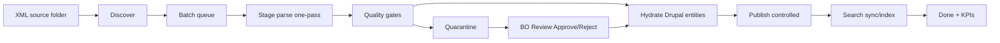
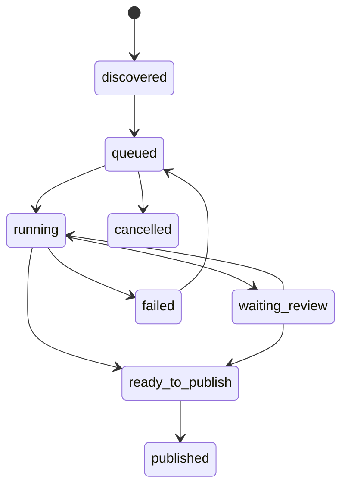

# Spécification Technique Exécutable - Pipeline Staging One-Pass

## 1) Objectif

Concevoir le module `ps_migrate_pipeline` comme orchestrateur d'import XML CRM avec:

- parsing XML en **une seule passe** vers des tables staging;
- gouvernance qualité (règles, quarantaine, validation manuelle BO);
- reprise sur erreur et publication contrôlée;
- observabilité opérationnelle;
- trajectoire de performance cible: **<= 30 min** pour un lot standard `bnppre_all_fr.xml` (environnement de prod dimensionné).

## 2) Périmètre et principes

### 2.1 Périmètre inclus

- découverte des fichiers XML à importer;
- gestion des lots (`batch`) et de leur cycle de vie;
- staging normalisé des données XML;
- quality gates pré/post import;
- quarantaine et workflow de décision;
- commandes Drush d'exploitation;
- interface BO MVP.

### 2.2 Périmètre exclu

- refonte du modèle métier Drupal (`offer`, `agent`, `media`, etc.);
- suppression des modules existants (`ps_offer`, `ps_search`, `ps_feature`, `ps_migrate`);
- migration historique de tous les anciens lots.

### 2.3 Principes de design

- **One-pass extraction**: un seul parse XML par fichier.
- **Idempotence**: relancer un lot ne duplique pas les entités.
- **State machine stricte**: transitions explicites et contrôlées.
- **Fail-safe**: erreurs isolées au niveau ligne, pas blocantes globalement si non critiques.
- **Config-first** pour règles et orchestration.

## 3) Architecture cible



## 4) Schéma de données (PostgreSQL)

Les tables ci-dessous sont créées par `hook_schema()` dans `ps_migrate_pipeline.install`.

## 4.1 Table lot

Table: `ps_mp_batch`

- `id` bigserial PK
- `source_filename` varchar(255) not null
- `source_path` text not null
- `source_checksum` varchar(64) not null
- `source_size_bytes` bigint not null
- `status` varchar(32) not null
- `discovered_at` int not null
- `started_at` int null
- `finished_at` int null
- `total_rows` int default 0
- `ok_rows` int default 0
- `quarantine_rows` int default 0
- `error_rows` int default 0
- `meta` jsonb null

Index:

- unique (`source_checksum`)
- index (`status`)

## 4.2 Table étapes de lot

Table: `ps_mp_batch_step`

- `id` bigserial PK
- `batch_id` bigint FK -> `ps_mp_batch.id`
- `step_code` varchar(64) not null
- `status` varchar(32) not null
- `started_at` int null
- `finished_at` int null
- `duration_ms` bigint null
- `message` text null
- `metrics` jsonb null

Index:

- unique (`batch_id`, `step_code`)

## 4.3 Table lignes staging (offres)

Table: `ps_mp_stage_offer`

- `id` bigserial PK
- `batch_id` bigint FK -> `ps_mp_batch.id`
- `business_id` varchar(64) not null
- `row_hash` varchar(64) not null
- `source_row_index` int not null
- `payload` jsonb not null
- `quality_status` varchar(32) not null default `pending`
- `hydration_status` varchar(32) not null default `pending`
- `entity_nid` int null
- `last_error` text null
- `updated_at` int not null

Index:

- unique (`batch_id`, `business_id`)
- index (`quality_status`)
- index (`hydration_status`)

## 4.4 Table quarantaine

Table: `ps_mp_quarantine`

- `id` bigserial PK
- `batch_id` bigint FK -> `ps_mp_batch.id`
- `stage_offer_id` bigint FK -> `ps_mp_stage_offer.id`
- `rule_code` varchar(128) not null
- `severity` varchar(16) not null
- `reason` text not null
- `status` varchar(32) not null default `open`
- `decision` varchar(32) null
- `decided_by` int null
- `decided_at` int null
- `comment` text null

Index:

- index (`batch_id`, `status`)
- index (`rule_code`)

## 4.5 Table événements

Table: `ps_mp_event`

- `id` bigserial PK
- `batch_id` bigint FK -> `ps_mp_batch.id`
- `event_type` varchar(64) not null
- `severity` varchar(16) not null
- `message` text not null
- `context` jsonb null
- `created_at` int not null

Index:

- index (`batch_id`, `created_at`)

## 5) Machine d'états

Statuts de lot (`ps_mp_batch.status`):

- `discovered`
- `queued`
- `running`
- `waiting_review`
- `partial_success`
- `failed`
- `ready_to_publish`
- `published`
- `cancelled`

Transitions autorisées:



Règles:

- `waiting_review` si quarantaine ouverte;
- `ready_to_publish` si toutes lignes hydratées ou explicitement rejetées;
- `partial_success` si erreurs non bloquantes mais lot exploitable;
- `failed` si erreur bloquante infra/parse/hydration critique.

## 6) Étapes pipeline exécutable

Ordre des étapes (`step_code`):

1. `discover_files`
2. `create_batch`
3. `stage_parse_one_pass`
4. `quality_precheck`
5. `hydrate_entities`
6. `quality_postcheck`
7. `publish`
8. `search_sync_index`
9. `close_batch`

## 6.1 One-pass parsing

Implémenter un parser stream XML (`XMLReader`) qui écrit `ps_mp_stage_offer.payload` en JSON normalisé:

- clés canoniques (business_id, operation_type, asset_type, budget, surfaces, technical_elements, media_refs, agents, addresses, etc.);
- hash ligne (`row_hash = sha256(payload canonique)`).

## 6.2 Hydration Drupal

Hydration par chunks (taille configurable):

- `HYDRATE_CHUNK_SIZE` défaut `200`;
- transaction par chunk;
- idempotence via `business_id` + `row_hash`.

## 7) Règles qualité

### 7.1 Moteur de règles

Service: `ps_migrate_pipeline.quality_engine`

Contrat:

- entrée: payload staging
- sortie: liste d'issues (`rule_code`, `severity`, `message`, `blocking`)

### 7.2 Exemples de règles initiales

- `GROUP_CODE_UNMAPPED` (blocking)
- `REQUIRED_FIELD_MISSING` (blocking)
- `BUDGET_PERIOD_INCONSISTENT` (warning/blocking selon config)
- `FEATURE_GROUP_UNKNOWN` (blocking)
- `AGENT_UID_MISSING` (warning)

Règles configurables via `config/install/ps_migrate_pipeline.quality_rules.yml`.

## 8) Commandes Drush (MVP)

Namespace: `ps:pipeline:*`

1. `ps:pipeline:discover`
- scan du dossier source
- création des lots `discovered`

2. `ps:pipeline:queue`
- passe les lots `discovered` en `queued`

3. `ps:pipeline:run`
- options: `--batch-id=`, `--from-step=`, `--to-step=`, `--chunk-size=`
- exécute machine d'états

4. `ps:pipeline:resume`
- reprend lot `failed` ou `waiting_review`

5. `ps:pipeline:quarantine:list`
- liste des lignes en quarantaine

6. `ps:pipeline:quarantine:approve`
- options: `--id=` ou `--batch-id= --rule-code=`

7. `ps:pipeline:quarantine:reject`
- options identiques + `--comment=`

8. `ps:pipeline:publish`
- publie un lot `ready_to_publish`

9. `ps:pipeline:metrics`
- KPI par lot (durée, lignes/s, erreurs)

## 9) Interface BO MVP

Routes:

- `/admin/ps/content/migrate-pipeline` (dashboard)
- `/admin/ps/content/migrate-pipeline/batch/{id}` (détail lot)
- `/admin/ps/content/migrate-pipeline/quarantine` (liste quarantaine)
- `/admin/ps/content/migrate-pipeline/quarantine/{id}` (décision)

Permissions:

- `administer ps migrate pipeline`
- `execute ps migrate pipeline`
- `review ps migrate quarantine`
- `publish ps migrate pipeline`

Dashboard MVP:

- lots récents + statuts + durées + compteurs;
- actions: discover, queue, run, resume, publish;
- lien direct vers quarantaine.

## 10) Observabilité et SLA

KPI obligatoires:

- durée totale lot;
- durée par étape;
- débit lignes/s;
- taux quarantaine;
- taux erreur;
- temps de publication;
- temps indexation search.

Sorties:

- table `ps_mp_event`;
- logs Drupal canal dédié `ps_migrate_pipeline`;
- endpoint Drush `ps:pipeline:metrics`.

## 11) Plan sprint par sprint

## Sprint 1 - Fondations pipeline

Livrables:

- module `ps_migrate_pipeline` scaffold;
- schéma SQL (`ps_mp_batch`, `ps_mp_batch_step`, `ps_mp_event`);
- commandes `discover`, `queue`, `run` (squelette);
- dashboard BO minimal (liste lots).

DoD:

- découverte idempotente par checksum;
- exécution d'un lot vide sans erreur;
- logs d'étapes persistés.

## Sprint 2 - Staging one-pass

Livrables:

- table `ps_mp_stage_offer`;
- parser `XMLReader` one-pass;
- quality engine v1 + `ps_mp_quarantine`;
- commandes quarantaine (`list`, `approve`, `reject`).

DoD:

- parse complet d'un XML standard sans rescan;
- quarantaine alimentée selon règles;
- reprise lot après décision BO.

## Sprint 3 - Hydration + publication contrôlée

Livrables:

- hydration chunkée vers entités Drupal;
- idempotence par `business_id` + `row_hash`;
- commande `publish`;
- sync/index search post publication.

DoD:

- relancer un lot ne duplique pas;
- publication partielle possible (lignes approuvées);
- index search cohérent.

## Sprint 4 - Performance 30 min + hardening

Livrables:

- tuning chunking + verrous concurrence;
- métriques détaillées (`ps:pipeline:metrics`);
- tests charge et runbook ops;
- alertes sur seuils (durée, erreur, quarantaine).

DoD:

- lot cible en environnement de référence proche SLA;
- reprise automatique robuste;
- dossier d'exploitation BO validé.

## 12) Plan d'implémentation fichiers (premier jet)

Module:

- `src/web/modules/custom/ps_migrate_pipeline/ps_migrate_pipeline.info.yml`
- `src/web/modules/custom/ps_migrate_pipeline/ps_migrate_pipeline.install`
- `src/web/modules/custom/ps_migrate_pipeline/ps_migrate_pipeline.routing.yml`
- `src/web/modules/custom/ps_migrate_pipeline/ps_migrate_pipeline.links.menu.yml`
- `src/web/modules/custom/ps_migrate_pipeline/ps_migrate_pipeline.permissions.yml`
- `src/web/modules/custom/ps_migrate_pipeline/ps_migrate_pipeline.services.yml`

Code:

- `src/Service/BatchDiscoveryService.php`
- `src/Service/StageParserService.php`
- `src/Service/QualityEngine.php`
- `src/Service/HydrationService.php`
- `src/Service/PipelineRunner.php`
- `src/Commands/PipelineCommands.php`
- `src/Controller/PipelineDashboardController.php`
- `src/Form/QuarantineDecisionForm.php`

Config:

- `config/install/ps_migrate_pipeline.settings.yml`
- `config/install/ps_migrate_pipeline.quality_rules.yml`

## 13) Commandes d'exploitation cible

```bash
# Découverte des nouveaux XML
drush ps:pipeline:discover

# Mise en file d'attente
drush ps:pipeline:queue

# Exécution d'un lot
drush ps:pipeline:run --batch-id=42 --chunk-size=200

# Reprise après correction quarantaine
drush ps:pipeline:resume --batch-id=42

# Publication contrôlée
drush ps:pipeline:publish --batch-id=42

# KPI lot
drush ps:pipeline:metrics --batch-id=42
```

## 14) Risques et mitigations

Risque:

- surcharge mémoire lors parse payload large.

Mitigation:

- `XMLReader` stream + flush chunk staging.

Risque:

- lock concurrent pipeline.

Mitigation:

- lock applicatif (`state` + DB advisory lock).

Risque:

- dérive mapping métier.

Mitigation:

- quality rules versionnées + tests fixtures.

## 15) Décision d'implémentation

Le cœur volumétrique est géré par `ps_migrate_pipeline` (staging one-pass + hydration),
et non par un chainage Migrate complet sur XML brut.
`ps_migrate` reste exploitable pour cas secondaires et compatibilité existante.
